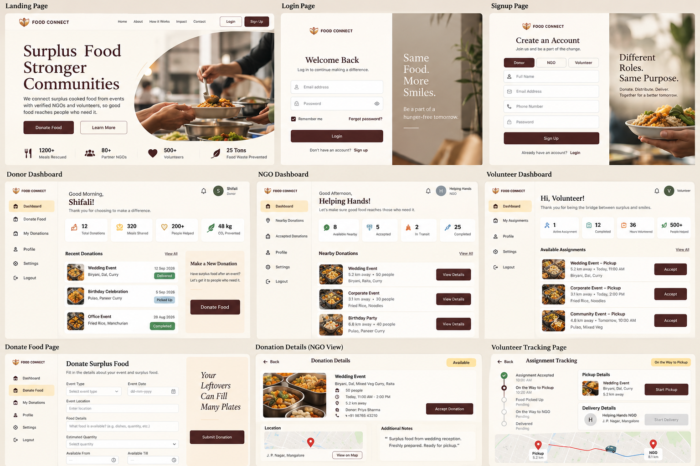

# FOOD CONNECT
# Design System & UI Specification

**Document Type:** Design System and UI Specification  
**Version:** 1.0  
**Status:** Design Baseline  
**Project:** FOOD CONNECT  
**Primary Reference:** Attached reference layout image  
**Scope:** Visual identity, UI system, interaction patterns, responsive behavior, accessibility, page-level interface rules, and design constraints

---

## 1. Purpose

This document is the visual source of truth for the FOOD CONNECT website and application interface.

It defines:

- Theme and visual philosophy
- Reference-image fidelity requirements
- Color palette and design tokens
- Typography
- Spacing and layout grid
- Component guidelines
- Form and dashboard patterns
- Navigation
- Cards and content rows
- Status indicators
- Skeleton loaders
- Empty, loading, error, and success states
- Responsive behavior
- Iconography
- Imagery
- Motion
- Accessibility
- Page-level UI specifications
- Prohibited visual patterns
- Design quality checklist

This document does not define backend architecture, database structure, API contracts, deployment, or infrastructure.

The project documentation has three separate responsibilities:

| Document | Responsibility |
|---|---|
| Product Requirements Document | Product scope, users, features, workflows, and requirements |
| Software Architecture Document | Technical architecture, technology stack, data, APIs, security, and infrastructure |
| Design System & UI Specification | Visual language, layout, components, interaction, responsive UI, and accessibility |

---

# 2. Reference Image and Visual Source of Truth

## 2.1 Reference Layout

The following image is the primary visual reference for the FOOD CONNECT interface.

**Reference image file:** `FOOD_CONNECT_Reference_Layout.png`

The implementation should closely reproduce the visual character, proportions, hierarchy, spacing, component treatment, photography style, and overall composition shown in the reference.

The reference image should be treated as the baseline when making visual decisions.

## 2.2 Reference Fidelity Requirement

The finished website should visually feel like the same design system represented in the reference image.

Developers should compare implemented pages against the reference for:

- Background warmth
- Burgundy intensity
- Typography scale
- Serif heading treatment
- Navigation proportions
- Card radius
- Border weight
- Image treatment
- Sidebar proportions
- Form dimensions
- Dashboard density
- Whitespace
- Button proportions
- Status badges
- Icon scale
- Overall visual calmness

When a new page is required that is not explicitly shown in the reference, it should extend the same visual language rather than introduce a new design style.

---

# 3. Theme and Visual Philosophy

## 3.1 Core Visual Direction

FOOD CONNECT uses a:

**Warm editorial + community impact + refined modern interface**

visual direction.

The interface should feel:

- Elegant
- Warm
- Human
- Calm
- Trustworthy
- Purposeful
- Premium
- Approachable
- Community-oriented

The interface should avoid looking overly technical, futuristic, playful, or corporate.

## 3.2 Emotional Direction

The visual language should support the idea of:

- Sharing surplus food
- Helping communities
- Responsible redistribution
- Human connection
- Food reaching people who need it
- Volunteers acting as a bridge
- NGOs coordinating support

The visual identity should create trust before users begin interacting with forms or dashboards.

## 3.3 Design Character

The design uses:

- Warm cream backgrounds
- Deep burgundy typography and primary actions
- Restrained beige and gold accents
- Editorial serif headings
- Clean sans-serif body text
- Thin borders
- Rounded but controlled corners
- Real food photography
- Generous whitespace
- Small, meaningful icons
- Quiet status colors
- Strong content hierarchy

## 3.4 Visual Restraint

Decorative elements must remain secondary to the content.

Avoid excessive:

- Gradients
- Glows
- Floating decorations
- Illustrations
- Animated backgrounds
- Oversized iconography
- Decorative shapes
- Color variations
- Shadows

---

# 4. Brand and Design Tokens

Design tokens are the shared visual values used throughout the application.

Tokens should be reused instead of creating arbitrary values for individual pages.

---

## 4.1 Color Palette

### Primary Brand Colors

| Token | Value | Usage |
|---|---|---|
| `--fc-burgundy` | `#4A2523` | Primary buttons, headings, navigation emphasis |
| `--fc-burgundy-dark` | `#351816` | Hover states, dark emphasis |
| `--fc-burgundy-soft` | `#6B403C` | Secondary burgundy text and muted accents |

### Background Colors

| Token | Value | Usage |
|---|---|---|
| `--fc-background` | `#F7F2E9` | Main page background |
| `--fc-surface` | `#FFFDF8` | Cards and elevated content surfaces |
| `--fc-surface-warm` | `#F8EFE1` | Warm secondary panels |
| `--fc-surface-muted` | `#F2EBDD` | Subtle grouped sections |

Pure white `#FFFFFF` must not be used as the main page background.

### Accent Colors

| Token | Value | Usage |
|---|---|---|
| `--fc-gold` | `#D7A94C` | Accent details and attention |
| `--fc-gold-light` | `#F5DF9F` | Soft accent backgrounds |
| `--fc-beige` | `#E8D8C1` | Decorative and supporting surfaces |

Gold should remain restrained. It must never become a dominant page color.

### Text Colors

| Token | Value | Usage |
|---|---|---|
| `--fc-text` | `#2D2422` | Main body text |
| `--fc-text-muted` | `#746B66` | Secondary text |
| `--fc-text-soft` | `#958B85` | Metadata and helper text |
| `--fc-text-on-dark` | `#FFF9F0` | Text on burgundy surfaces |

### Border Colors

| Token | Value | Usage |
|---|---|---|
| `--fc-border` | `#E7DED1` | Standard borders |
| `--fc-border-strong` | `#D6C8B8` | Emphasized boundaries |

### Semantic Colors

| Token | Value | Usage |
|---|---|---|
| `--fc-success` | `#5F8F65` | Completed, delivered, successful |
| `--fc-success-soft` | `#E8F0E6` | Success badge background |
| `--fc-warning` | `#B98228` | Pending, attention |
| `--fc-warning-soft` | `#F8EBCB` | Warning badge background |
| `--fc-danger` | `#B84C46` | Errors and destructive actions |
| `--fc-danger-soft` | `#F5E3E0` | Error background |
| `--fc-info` | `#557A8A` | Informational states |
| `--fc-info-soft` | `#E4EDF0` | Information background |

Semantic colors must be used according to meaning. They must not be used simply to add visual variety.

---

# 5. Prohibited Color Treatments

The following are prohibited:

1. Harsh gradients
2. Neon colors
3. Rainbow color systems
4. Fluorescent backgrounds
5. Excessive saturated accent colors
6. Gradient text
7. Large glowing effects
8. Neon borders
9. Color combinations that reduce text readability
10. Arbitrary colors assigned to unrelated components

---

# 6. Typography

## 6.1 Typography Direction

Typography is one of the primary elements of the FOOD CONNECT visual identity.

The reference uses a refined serif display style paired with a clean, neutral sans-serif interface style.

## 6.2 Required Font Families

### Display Font

**Playfair Display**

Use for:

- Hero headings
- Page titles
- Major section headings
- Authentication headings
- Editorial statements
- Important emotional copy

### UI and Body Font

Use a neutral sans-serif font that is **not**:

- Inter
- Geist
- Space Grotesk

Recommended project direction:

**DM Sans**

Use for:

- Body copy
- Navigation
- Buttons
- Forms
- Tables
- Dashboard labels
- Metadata
- Status text

The interface must maintain a clear visual distinction between display typography and UI typography.

## 6.3 Typography Scale

| Token | Size | Typical Usage |
|---|---:|---|
| `display-xl` | 64px | Large desktop hero |
| `display-lg` | 52px | Major hero/page heading |
| `heading-xl` | 40px | Major page section |
| `heading-lg` | 32px | Page title |
| `heading-md` | 26px | Card or section title |
| `heading-sm` | 21px | Subsection |
| `body-lg` | 18px | Introductory paragraph |
| `body-md` | 15px | Standard body |
| `body-sm` | 13px | Supporting text |
| `caption` | 11px | Metadata |
| `label` | 12px | Form labels and badges |

## 6.4 Typography Rules

Headings should generally use:

- Playfair Display
- Burgundy
- Moderate font weight
- Comfortable line height

Body text should generally use:

- DM Sans
- Dark warm brown
- Comfortable line height
- Moderate letter spacing

Avoid:

- All-caps paragraphs
- Excessive bold text
- Extremely tight line spacing
- Decorative script fonts
- More than two primary font families
- Random font-size changes between similar components

---

# 7. Spacing System

Use a consistent spacing scale.

| Token | Value |
|---|---:|
| `space-1` | 4px |
| `space-2` | 8px |
| `space-3` | 12px |
| `space-4` | 16px |
| `space-5` | 20px |
| `space-6` | 24px |
| `space-8` | 32px |
| `space-10` | 40px |
| `space-12` | 48px |
| `space-16` | 64px |
| `space-20` | 80px |
| `space-24` | 96px |

The interface should prioritize generous whitespace.

Do not compress unrelated elements simply to fit more content into a viewport.

---

# 8. Layout Grid

## 8.1 Desktop

Primary desktop content should use a centered max-width container.

Recommended:

- Maximum width: 1440px
- Horizontal padding: 32px to 48px
- Grid: 12 columns
- Column gap: 24px

## 8.2 Tablet

Recommended:

- 8-column grid
- 24px horizontal padding
- 20px column gap

## 8.3 Mobile

Recommended:

- 4-column grid
- 16px horizontal padding
- 12px column gap

## 8.4 Dashboard Layout

Dashboards use a two-part structure:

**Persistent sidebar + main content area**

Desktop:

- Sidebar: approximately 220px to 250px
- Main content: flexible
- Main content max width should prevent excessively long reading lines

Mobile:

- Sidebar becomes a compact navigation drawer or top navigation
- Main content becomes full width
- Dashboard cards stack vertically

---

# 9. Border Radius

Use controlled rounded corners.

| Token | Value | Usage |
|---|---:|---|
| `radius-sm` | 6px | Inputs, small controls |
| `radius-md` | 8px | Buttons and standard cards |
| `radius-lg` | 12px | Main cards |
| `radius-xl` | 18px | Hero imagery and major surfaces |
| `radius-full` | 9999px | Avatars and pills |

Avoid excessive pill-shaped UI.

---

# 10. Shadows

Drop shadows are prohibited as a general design treatment.

Do not use:

- Large floating shadows
- Strong card shadows
- Glow shadows
- Neon shadows

Depth should be created using:

- Background contrast
- Thin borders
- Surface color changes
- Spacing
- Typography
- Image framing

If a browser-level shadow is absolutely necessary for a functional overlay, it must be extremely subtle and should not become part of the visual identity.

---

# 11. Icons

## 11.1 Icon Library

Do not use Lucide icons.

Use **React Icons** with a consistent icon family wherever possible.

## 11.2 Icon Style

Icons should be:

- Simple
- Thin to medium weight
- Consistent in visual density
- Small relative to text
- Semantically meaningful

Recommended sizes:

| Context | Size |
|---|---:|
| Inline | 14px |
| Form | 16px |
| Navigation | 17px |
| Dashboard metric | 18px to 22px |
| Feature emphasis | 24px |

Icons should never replace important text labels when the meaning could become ambiguous.

## 11.3 No Emojis

Do not use emojis in:

- Navigation
- Buttons
- Cards
- Dashboard metrics
- Empty states
- Notifications
- Headings
- Marketing sections

---

# 12. Navigation

## 12.1 Landing Page Navigation

The landing-page header should follow the reference:

- Warm surface
- Food Connect logo at left
- Compact navigation in the center/right
- Login secondary button
- Sign Up primary button
- Generous horizontal spacing
- No oversized navigation bar

Navigation items:

- Home
- About
- How It Works
- Impact
- Contact

Authentication actions:

- Login
- Sign Up

## 12.2 Dashboard Navigation

Dashboard navigation uses a vertical sidebar.

Primary elements:

- Logo
- Dashboard
- Role-specific navigation
- Profile
- Settings
- Logout

The active navigation item should use a warm highlighted surface.

Do not use a colored vertical stripe to indicate the active item.

## 12.3 Mobile Navigation

On mobile:

- Use a compact header
- Keep the logo visible
- Use a menu control for secondary navigation
- Avoid overcrowding the top bar
- Preserve large touch targets

---

# 13. Logo

The logo should remain visually simple and recognizable.

The reference uses a warm food/community symbol paired with:

**FOOD CONNECT**

Supporting tagline where applicable:

**Share. Rescue. Connect.**

Logo rules:

- Do not stretch the logo
- Do not recolor arbitrarily
- Do not add gradients
- Do not add glow
- Maintain sufficient clear space
- Use the dark logo on light surfaces
- Use the light treatment only where required

---

# 14. Buttons

## 14.1 Primary Button

Primary button:

- Burgundy background
- Warm light text
- 8px radius
- Medium font weight
- Compact but comfortable height
- Subtle hover color transition

Example uses:

- Donate Food
- Sign Up
- Login
- Accept Donation
- Start Pickup
- Submit Donation

## 14.2 Secondary Button

Secondary button:

- Transparent or warm surface
- Burgundy text
- Thin burgundy or neutral border
- Same height as primary button

Example:

- Learn More
- View Details
- View on Map

## 14.3 Tertiary Action

Use text-based actions when the action is secondary:

- View All
- Back
- Edit
- Cancel

Avoid turning every action into a filled button.

## 14.4 Button States

Every interactive button must define:

- Default
- Hover
- Focus
- Active
- Disabled
- Loading

Disabled buttons should use muted neutral colors and reduced emphasis.

---

# 15. Forms

Forms should be calm, spacious, and easy to scan.

## 15.1 Input Style

Inputs should use:

- Warm surface
- Thin neutral border
- 8px radius
- 44px to 48px minimum height
- Clear label
- Comfortable horizontal padding

Avoid heavy borders.

## 15.2 Labels

Labels should appear above inputs.

Do not rely on placeholder text as the only label.

## 15.3 Placeholder Text

Placeholder text should provide an example or hint.

It should not replace the label.

## 15.4 Focus State

Focus should be visually obvious.

Use:

- Burgundy or warm gold focus ring
- Increased border contrast
- No glow

## 15.5 Validation

Error states should include:

- Clear error text
- Relevant input association
- Semantic red
- No aggressive animation

Success states should use the semantic green palette.

---

# 16. Authentication UI

The Login and Sign Up pages should closely follow the reference image.

## 16.1 Split Layout

Desktop authentication layout:

- Left: form area
- Right: large real food/community photograph

The form side should use a warm cream surface.

The image side should use a high-quality photograph with rounded treatment consistent with the reference.

## 16.2 Login

Include:

- Food Connect logo
- Welcome Back heading
- Short supporting text
- Email input
- Password input
- Remember Me
- Forgot Password
- Login button
- Sign Up navigation

## 16.3 Sign Up

Include:

- Food Connect logo
- Create an Account heading
- Supporting text
- Role selector
- Full Name
- Email
- Phone
- Password
- Sign Up button
- Login navigation

Role selector options:

- Donor
- NGO
- Volunteer

Role selection must be clear without relying only on color.

---

# 17. Landing Page

The landing page should closely follow the reference composition.

## 17.1 Hero

The hero should contain:

- Large Playfair Display heading
- Short product explanation
- Primary CTA
- Secondary CTA
- Large rounded food photograph
- Balanced text/image composition

Reference direction:

**Surplus Food  
Stronger Communities**

Supporting message should explain that FOOD CONNECT connects surplus cooked food from events with verified NGOs and volunteers so food can reach people who need it.

## 17.2 Hero Image

Use real food photography.

The image should:

- Show prepared food
- Feel authentic
- Have warm natural lighting
- Avoid artificial AI-generated appearance
- Use a rounded crop
- Have enough detail to remain visually rich

## 17.3 Impact Metrics

Impact metrics may be displayed beneath the hero.

They should use a horizontal editorial layout rather than three feature cards in a row.

Each metric can include:

- Small icon
- Numeric value
- Short label

Do not use fabricated statistics.

If real metrics are unavailable during development, use clearly labeled placeholders in development environments and replace them with real product data before production.

---

# 18. Three-Column Feature Rule

Do not use a standard row of three feature cards.

Avoid the common:

**Card + Card + Card**

marketing pattern.

For process or feature explanation, use alternatives such as:

- Horizontal editorial sections
- Numbered process rows
- Alternating image/text sections
- Timeline-style flows
- Large single feature blocks
- Two-column content compositions

---

# 19. Dashboard Design

The reference establishes the dashboard visual language.

Dashboards should feel organized without becoming dense enterprise software.

## 19.1 Dashboard Structure

Desktop structure:

1. Sidebar
2. Header/profile area
3. Greeting
4. Role-specific summary
5. Metrics
6. Main operational content
7. Supporting actions

## 19.2 Greeting Area

Use:

- Greeting
- User/organization name
- Short contextual message
- Notification icon
- Profile avatar or initials

Example structure:

**Good Morning,  
Shifali!**

Supporting copy should remain short.

## 19.3 Metric Blocks

Metrics should be compact horizontal or responsive blocks.

Each metric includes:

- Small semantic icon
- Large numeric value
- Short label

Metrics must reflect real data when connected to the application.

Do not invent permanent statistics.

## 19.4 Dashboard Cards

Cards should use:

- Warm surface
- Thin border
- 8px to 12px radius
- No visible drop shadow
- Generous internal spacing

---

# 20. Donor Dashboard

The donor dashboard should provide:

- Greeting
- Donation summary
- Recent donations
- Make a New Donation CTA
- Donation history access
- Profile/settings navigation

## 20.1 Recent Donations

Each donation row should show:

- Food/event thumbnail
- Event name
- Food type summary
- Date
- Donation status

Status should use a semantic badge.

## 20.2 Make a New Donation

A visually distinct action panel should encourage the donor to create another donation.

Use warm beige rather than a bright promotional color.

---

# 21. Donate Food Page

The donation form should follow the reference.

## 21.1 Form Content

Fields may include:

- Event Type
- Event Date
- Event Location
- Food Details
- Estimated Quantity
- Available From
- Available Till
- Additional Notes where required

## 21.2 Supporting Visual

A warm editorial panel may accompany the form.

The panel should contain a short statement related to food sharing.

Do not overload it with illustrations or decorative elements.

---

# 22. NGO Dashboard

The NGO dashboard should prioritize discovery and action.

Include:

- Greeting
- Available nearby donations
- Accepted donations
- In-transit donations
- Completed donations
- Nearby donation list

## 22.1 Donation List

Each row should contain:

- Real food image
- Event name
- Distance
- Approximate people/quantity information
- Food summary
- View Details action

## 22.2 Donation Detail

The NGO donation detail page should contain:

- Back navigation
- Donation title
- Food image
- Availability status
- Food information
- Quantity
- Pickup time
- Location
- Donor information where permitted
- Additional notes
- Map/location area
- Accept Donation action

---

# 23. Volunteer Dashboard

The volunteer dashboard should focus on assignments and delivery progress.

Include:

- Greeting
- Active assignment
- Completed assignments
- Hours volunteered
- People helped
- Available assignments

## 23.1 Assignment Rows

Each assignment should contain:

- Food/event thumbnail
- Event name
- Pickup location/distance
- Pickup time
- Food summary
- Accept action

---

# 24. Volunteer Tracking Page

The tracking page should follow the reference composition.

## 24.1 Timeline

Use a vertical timeline showing:

1. Assignment Accepted
2. On the Way to Pickup
3. Food Picked Up
4. On the Way to NGO
5. Delivered

Each state should have:

- Status marker
- Label
- Timestamp when available
- Current/pending state

Avoid colored left stripes as status indicators.

## 24.2 Map Area

The map area should use:

- Clean map styling
- Pickup marker
- NGO marker
- Route line
- Supporting pickup/delivery details

The map should remain secondary to the tracking information.

---

# 25. Status System

Statuses should use text plus color.

Examples:

### Available
Warm gold background with dark text.

### Accepted
Soft information or burgundy treatment.

### In Transit
Warm accent treatment.

### Picked Up
Information or neutral treatment.

### Delivered
Soft green treatment.

### Cancelled
Soft red treatment.

Status colors should remain muted and accessible.

---

# 26. Cards

Cards are structural containers rather than decorative objects.

Card rules:

- Warm surface
- Thin border
- Controlled radius
- No drop shadow
- Consistent padding
- Clear hierarchy

Cards should be used for:

- Donation items
- Metrics
- Profile information
- Forms
- Dashboard sections
- Assignment details

Do not turn every piece of information into a separate card.

---

# 27. Tables and Lists

Operational information should generally use lists or compact table structures rather than decorative card grids.

Use:

- Clear column headings
- Consistent alignment
- Compact rows
- Adequate row spacing
- Status badges
- Action controls

On mobile, tables should transform into readable stacked rows when necessary.

---

# 28. Modals and Dialogs

Dialogs should use:

- Warm surface
- Thin border
- Controlled radius
- Clear heading
- Supporting explanation
- Primary action
- Secondary cancel action

Avoid large visual effects.

Dialogs must trap keyboard focus and provide an accessible close mechanism.

---

# 29. Notifications

Notifications should be concise and actionable.

Types:

- Success
- Warning
- Error
- Informational

Notifications should include:

- Clear title or message
- Optional supporting detail
- Dismiss control when appropriate

Do not rely on color alone.

---

# 30. Empty States

Empty states should be useful and calm.

Examples:

- No donations yet
- No available assignments
- No accepted donations
- No completed deliveries

An empty state should contain:

1. Small relevant icon or restrained illustration if genuinely useful
2. Clear heading
3. Short explanation
4. Relevant action when one exists

Do not use emojis.

Do not invent activity to make an empty dashboard look populated.

---

# 31. Loading States

Loading states should preserve layout stability.

Use:

- Skeleton loaders for content areas
- Spinner only for short action-level waits
- Disabled/loading button states during submissions

Avoid full-page spinners when content can be progressively loaded.

---

# 32. Skeleton Loader Specification

Skeleton loaders are required for major asynchronous UI regions.

## 32.1 Skeleton Appearance

Skeletons should use warm neutral colors.

Recommended:

- Base: `#EDE4D7`
- Highlight: `#F6EFE5`

No bright white skeletons.

No gradient shimmer effects.

If animation is used, use a subtle opacity transition rather than a strong animated gradient.

## 32.2 Skeleton Rules

Skeleton dimensions should closely match the final content dimensions.

Do not use generic blocks that cause the layout to jump when real content loads.

## 32.3 Required Skeleton Variants

### Dashboard Skeleton

Include placeholders for:

- Greeting
- Metric blocks
- Recent list
- Supporting action panel

### Donation List Skeleton

Each row should contain:

- Image placeholder
- Title placeholder
- Metadata placeholder
- Action placeholder

### Donation Detail Skeleton

Include:

- Image area
- Title
- Metadata
- Information blocks
- Action area
- Map placeholder

### Profile Skeleton

Include:

- Avatar
- Name
- Metadata
- Form fields

### Table/List Skeleton

Rows should match the final row height.

## 32.4 Skeleton Accessibility

Skeleton content must not be announced repeatedly by screen readers as meaningful content.

Where appropriate:

- Use `aria-busy="true"` on the loading region
- Provide a concise loading status
- Remove loading state semantics when content is ready

---

# 33. Imagery

## 33.1 Photography Direction

Photography is a major part of the visual identity.

Use:

- Real food photography
- Event food
- Prepared meals
- Food packaging
- Volunteers
- Community distribution
- Human hands interacting with food
- Authentic local/community environments

Photography should feel:

- Warm
- Natural
- Documentary
- Human
- Trustworthy

## 33.2 Avoid

Do not use:

- Artificial AI-looking food imagery
- Overly polished stock photography
- Generic corporate handshake imagery
- Unrealistic food arrangements
- Excessive filters
- Neon color grading

## 33.3 Image Treatment

Images should generally use:

- Rounded corners
- Natural cropping
- Consistent aspect ratios
- Warm but realistic color
- Adequate object visibility

---

# 34. Fake Data Policy

The UI must not present fabricated impact statistics, testimonials, NGO records, donor records, donation records, or delivery history as genuine product data.

Development fixtures may be used internally when necessary for implementation.

Development fixtures must:

- Be clearly identified in development
- Never be represented as verified real-world impact
- Be replaceable by API data
- Not be used as marketing claims

Do not create fake testimonials.

Do not create fake reviews.

Do not create fake success stories.

---

# 35. Real Product Demonstration Policy

The interface should prioritize real product workflows and actual application states.

Do not create decorative mock product demonstrations that pretend to represent real operational activity.

When demonstrating the UI during development:

- Use clearly labeled demo data
- Keep the interface structurally realistic
- Avoid false claims
- Replace demo content before production

---

# 36. Motion and Animation

Motion should be subtle and functional.

Use animation for:

- Page transitions
- Button hover states
- Navigation state changes
- Modal appearance
- Loading transitions
- List insertion/removal
- Progress changes

Preferred duration:

- Fast interaction: 150ms to 200ms
- Standard: 200ms to 300ms
- Large transition: 300ms to 450ms

Avoid:

- Bouncy UI
- Excessive parallax
- Spinning decorative objects
- Continuous floating animations
- Large entrance animations
- Distracting hover effects

Respect `prefers-reduced-motion`.

---

# 37. Accessibility

Accessibility is a required part of the design system.

## 37.1 Color Contrast

Text must have sufficient contrast against its background.

Do not communicate information through color alone.

## 37.2 Keyboard Navigation

All interactive elements must be keyboard accessible.

Focus states must be clearly visible.

## 37.3 Touch Targets

Interactive controls should provide approximately 44px minimum touch targets where practical.

## 37.4 Labels

All form controls must have accessible labels.

## 37.5 Images

Meaningful images require descriptive alternative text.

Decorative images should use appropriate empty alt text.

## 37.6 Status Communication

Status should combine:

- Text
- Appropriate iconography where useful
- Color

## 37.7 Error Messages

Errors must explain:

- What went wrong
- Which field or action is affected
- What the user can do next

## 37.8 Focus Management

Modals, drawers, menus, and dialogs must manage focus correctly.

## 37.9 Motion

Support reduced-motion preferences.

---

# 38. Responsive Design

The interface must be designed for:

- Desktop
- Laptop
- Tablet
- Mobile

## 38.1 Desktop

Prioritize:

- Two-column layouts
- Dashboard sidebar
- Large imagery
- Comfortable whitespace
- Horizontal metric groups

## 38.2 Tablet

Adapt by:

- Reducing column count
- Reducing image sizes
- Allowing metric wrapping
- Maintaining readable form widths

## 38.3 Mobile

Mobile layouts should:

- Stack content vertically
- Collapse sidebars
- Use full-width primary actions
- Maintain 16px page padding
- Preserve readable typography
- Avoid horizontal scrolling
- Keep images visible without excessive height

---

# 39. Responsive Component Rules

Components must not simply shrink indefinitely.

### Navigation

Desktop navigation becomes a compact mobile menu.

### Dashboard

Sidebar becomes a drawer or compact navigation.

### Metrics

Horizontal metric groups become a responsive grid or stacked list.

### Forms

Multi-column desktop forms become one-column mobile forms.

### Detail Pages

Side-by-side content becomes vertically ordered content.

### Tables

Wide tables become responsive stacked rows when necessary.

### Buttons

Primary actions may become full-width on mobile.

---

# 40. Accessibility and Interaction States

Every interactive component should define:

1. Default
2. Hover
3. Focus
4. Active
5. Disabled
6. Loading
7. Error where applicable
8. Success where applicable

A design is incomplete if only the default state has been specified.

---

# 41. Component Inventory

The reusable UI system should include:

## Global

- Logo
- Button
- Icon Button
- Link
- Container
- Divider
- Badge
- Avatar
- Tooltip
- Notification
- Modal
- Confirmation Dialog
- Skeleton

## Navigation

- Public Navbar
- Dashboard Sidebar
- Mobile Navigation
- Breadcrumbs
- Back Navigation

## Forms

- Input
- Password Input
- Select
- Date Input
- Time Input
- Textarea
- Checkbox
- Radio
- Role Selector
- Form Field
- Validation Message

## Data Display

- Metric
- Donation Row
- Assignment Row
- Donation Card
- Status Badge
- Timeline
- Data Table
- Empty State
- Loading State

## Layout

- Page Container
- Section
- Split Panel
- Content Panel
- Dashboard Layout
- Authentication Layout

---

# 42. Component Consistency Rules

A component should have one consistent visual language across the application.

For example:

- All primary buttons use the same base styling
- All inputs share the same height and radius
- All dashboard cards share the same border treatment
- All status badges follow the semantic color system
- All page headings use the same hierarchy
- All icons use the same visual weight

Do not create page-specific versions of common components without a documented reason.

---

# 43. UI Content Tone

UI copy should be:

- Clear
- Warm
- Respectful
- Human
- Direct

Avoid:

- Excessive marketing language
- Corporate jargon
- Overly dramatic claims
- Artificially inspirational phrases
- Long paragraphs inside dashboards

Use short action-oriented labels.

Examples:

- Donate Food
- View Details
- Accept Donation
- Start Pickup
- View on Map
- Track Delivery
- View All

---

# 44. Forbidden Visual Patterns

The following are explicitly prohibited throughout FOOD CONNECT:

1. Harsh gradients
2. Lucide icons
3. Pure white page backgrounds
4. Rainbow coding
5. Drop shadows
6. Standard three-feature-card rows
7. Emojis
8. Liquid glass effects
9. Em dashes
10. Inter
11. Geist
12. Space Grotesk
13. Colored left stripes
14. Fake testimonials
15. Fake product data presented as real
16. Bento grids
17. Terminal-window UI
18. The phrase structure "It's not X, it's Y"
19. Checkmark bullets as a visual design device
20. Three pricing tiers
21. Fake product demonstrations
22. Neon colors
23. Excessive glassmorphism
24. Glowing borders
25. Excessive rounded pill interfaces
26. Decorative gradients behind every section
27. Excessive floating animations
28. Generic SaaS template styling

---

# 45. Page Design Inventory

The design system must support the following core pages.

## Public

- Landing Page
- About
- How It Works
- Impact
- Contact
- FAQ

## Authentication

- Login
- Sign Up
- Forgot Password
- Reset Password

## Donor

- Donor Dashboard
- Donate Food
- My Donations
- Donation Details
- Profile
- Settings

## NGO

- NGO Dashboard
- Nearby Donations
- Donation Details
- Accepted Donations
- Profile
- Settings

## Volunteer

- Volunteer Dashboard
- Available Assignments
- Assignment Details
- Tracking
- Completed Assignments
- Profile
- Settings

---

# 46. Page-Level Consistency

Every page should preserve:

- Same background system
- Same typography
- Same button system
- Same border treatment
- Same icon system
- Same status colors
- Same spacing scale
- Same interaction states
- Same accessibility standards

A page may introduce a unique layout when the content requires it, but it must still use the shared design tokens and components.

---

# 47. Design QA Checklist

Before considering a page complete, verify:

### Visual

- [ ] Reference-image visual language is maintained
- [ ] Background is warm and not pure white
- [ ] Burgundy remains the primary brand color
- [ ] Gold is restrained
- [ ] Typography uses the approved families
- [ ] No prohibited gradients exist
- [ ] No neon colors exist
- [ ] No drop shadows are used
- [ ] No liquid glass effects exist
- [ ] No bento grid exists
- [ ] No three-feature-card row exists
- [ ] No colored left stripe exists
- [ ] No emojis exist
- [ ] No fake testimonials exist
- [ ] No fabricated production impact claims exist

### Layout

- [ ] Spacing follows the token scale
- [ ] Cards use consistent radius and borders
- [ ] Content has sufficient whitespace
- [ ] Desktop layout is balanced
- [ ] Tablet layout is usable
- [ ] Mobile layout is usable
- [ ] No unintended horizontal scrolling exists

### Interaction

- [ ] Hover states exist
- [ ] Focus states exist
- [ ] Disabled states exist
- [ ] Loading states exist
- [ ] Error states exist
- [ ] Success states exist
- [ ] Skeleton loaders preserve layout

### Accessibility

- [ ] Keyboard navigation works
- [ ] Focus indicators are visible
- [ ] Form fields have labels
- [ ] Images have appropriate alt text
- [ ] Color is not the only status indicator
- [ ] Touch targets are sufficiently large
- [ ] Reduced-motion behavior is supported

---

# 48. Implementation Guidance

The UI should be implemented as a reusable design system rather than as isolated page-specific styling.

Shared tokens should be defined centrally.

Shared components should be reused across:

- Landing pages
- Authentication
- Donor dashboards
- NGO dashboards
- Volunteer dashboards

The reference image should be consulted whenever a visual decision is ambiguous.

The priority order for resolving visual decisions is:

1. Reference image
2. This design system
3. Product requirements
4. Accessibility requirements
5. Existing reusable components
6. Developer preference

---

# 49. Design Definition of Done

A page is considered visually complete when:

- It follows the FOOD CONNECT visual language
- It matches the reference style closely
- It uses approved design tokens
- It uses approved typography
- It uses reusable components
- It includes responsive layouts
- It includes loading states where applicable
- It includes skeleton loaders for asynchronous content
- It includes empty states where applicable
- It includes error and success states where applicable
- It has accessible focus and keyboard behavior
- It contains no prohibited visual patterns
- It does not use fabricated production claims
- It does not introduce an unrelated visual style

---

# 50. Final Design Statement

FOOD CONNECT should present a warm, refined, editorial interface centered on real food, real community action, and clear operational workflows.

The reference image is the primary visual benchmark.

The visual system is built around:

**Cream surfaces + deep burgundy + restrained gold + Playfair Display + DM Sans + real photography + thin borders + controlled radius + generous whitespace + clear interaction states.**

Every new page should look like it belongs to the same product.

The interface should remain calm, trustworthy, human, and highly usable across public pages, authentication, donor workflows, NGO workflows, and volunteer tracking.
